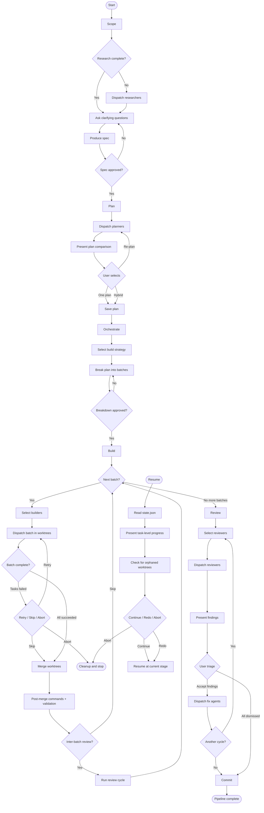

# Pipeline Stages

Invoke executes development work through a structured pipeline of six stages: Scope, Plan, Orchestrate, Build, Review, and (when needed) Resume. Each stage has a distinct responsibility, produces durable artifacts, and requires specific user decisions before advancing.

---

## Full Pipeline Flow

---

## Stage 1: Scope

### What it does

The scope stage establishes shared understanding of what needs to be built before any implementation begins.

If the project has no `context.md` yet, scope first initializes project context. For existing codebases it dispatches a `codebase` researcher to analyze structure, tech stack, patterns, and dependencies, then uses those findings to ask targeted questions and generate a `context.md`. For greenfield projects it skips research and gathers the same information interactively.

Once context exists, scope dispatches the selected researchers in parallel. Each researcher explores a specific domain (security posture, existing patterns, external APIs, performance characteristics, etc.) and returns a report. The aggregated research informs a series of clarifying questions asked one at a time, focusing only on decisions that require human judgment — things the research did not already answer.

When the answers are sufficient, scope produces a written spec.

### User decisions

- Which researchers to dispatch (multi-select from configured researchers)
- Answers to clarifying questions (purpose, constraints, success criteria, edge cases, non-functional requirements)
- Spec approval (reject sends the conversation back to clarifying questions)

### Artifacts

`specs/YYYY-MM-DD-<slug>-spec.md`

The spec covers: goal, specific and testable requirements, technical constraints, acceptance criteria, and an explicit out-of-scope list.

### Resume behavior

If the session is interrupted after research completes but before the spec is written, invoke-scope resumes at the clarifying questions step. Research results are already available and do not need to be re-run.

---

## Stage 2: Plan

### What it does

The plan stage generates competing implementation approaches and lets the user choose how to proceed.

Planners are dispatched in parallel, each receiving the full spec content and any available research reports. Each planner proposes a distinct approach to implementing the spec. Once all planners complete, the results are presented with per-plan summaries (approach, key technical decisions, what it optimizes for), a cross-plan comparison (where they agree, where they differ, trade-offs), and a recommendation.

### User decisions

- Which planners to dispatch (multi-select; running multiple planners gives competing approaches to compare)
- Which plan to adopt: one plan as-is, a hybrid combining elements from multiple plans, or a re-plan with additional constraints added

### Artifacts

`plans/YYYY-MM-DD-<slug>-plan.md`

The filename slug matches the spec (e.g., if the spec is `2026-04-03-auth-middleware-spec.md`, the plan is `2026-04-03-auth-middleware-plan.md`).

### Resume behavior

If interrupted before planners are dispatched, invoke-plan resumes at planner selection. If interrupted after planners complete but before the user has chosen, invoke-plan resumes at the plan comparison and selection step.

---

## Stage 3: Orchestrate

### What it does

The orchestrate stage translates the chosen plan into a concrete, executable task graph.

The plan is decomposed into individual tasks. Each task must be self-contained (an agent can complete it without understanding the whole system), small (targeting 1–3 files), and well-defined with clear acceptance criteria. Tasks that would touch the same file are placed in different batches to avoid conflicts.

Tasks are grouped into sequential batches where all tasks within a single batch are independent and can run in parallel. Batch 1 handles foundational work (types, interfaces, core utilities). Later batches build on earlier outputs.

The build strategy (e.g., `tdd`, `default`) is also selected here and applies to all builder prompts downstream.

### User decisions

- Build strategy selection (the configured default is marked as recommended)
- Task breakdown approval — the user can request tasks be split, merged, or reordered before confirming

### Artifacts

`plans/YYYY-MM-DD-<slug>-tasks.json`

The tasks file contains the chosen strategy and the full batch/task structure, including each task's description, acceptance criteria, relevant files, and interface contracts.

### Resume behavior

If interrupted before the breakdown is approved, invoke-orchestrate resumes at the task breakdown presentation and approval step.

---

## Stage 4: Build

### What it does

The build stage executes the task graph: dispatching agents in isolated git worktrees, merging results, running post-merge commands, validating, and optionally running inter-batch reviews.

For each batch, the user selects which builders to use, then the batch is dispatched. Each agent works in its own worktree so the main work branch stays clean. Progress is reported as tasks complete. When a batch finishes, each completed task's worktree is merged via squash and cleaned up.

After all worktrees in a batch are merged, post-merge commands run (e.g., regenerating `composer.lock` or `package-lock.json`), followed by the configured validation hook (lint, tests). If validation fails, the failure is presented and must be resolved before the next batch starts.

Between batches, the user can optionally run reviewers against the current state of the codebase before proceeding. This follows the same flow as the review stage and can catch issues early.

### User decisions

- Builder selection for each batch (multi-select from configured builders)
- Error recovery when a task fails: retry, skip, or abort the batch
- Inter-batch review: select reviewers to run, or skip and proceed to the next batch

### Artifacts

Code changes merged into the work branch. No separate document artifact is produced; the git history records the per-task squash commits.

### Resume behavior

When resuming a build, invoke-build advances to the next incomplete batch. Within a batch, only tasks that are not already marked `completed` are re-dispatched. The resume prompt reports how many tasks in the batch were already done and how many remain.

---

## Stage 5: Review

### What it does

The review stage runs one or more structured review passes against the completed work, triages findings with the user, dispatches fix agents, and loops until the user is satisfied. It then updates project context and commits the final result.

Reviewers (security, code quality, performance, accessibility, etc.) are dispatched in parallel and receive a summary of what was built plus a full git diff. Each reviewer returns structured findings with severity, file location, description, and suggested fix.

Findings are presented grouped by reviewer. The user triages each finding individually (or in bulk per reviewer): accepted findings are bundled into fix tasks and dispatched as a new build batch, dismissed findings are skipped.

After fixes are applied the user can run another review cycle or declare the pipeline complete.

On completion, the review stage:
1. Saves the review history as a JSON artifact
2. Updates `context.md` to record the completed work, any architectural changes, and any accepted-but-deferred findings
3. Asks the user for a commit strategy and executes it

### User decisions

- Reviewer selection (multi-select)
- Finding triage: accept (dispatch for fixing) or dismiss (false positive or intentional) — each finding is decided individually
- Whether to run another review cycle or proceed to commit
- Commit strategy: one squash commit, one commit per batch, one commit per task, or custom grouping

### Artifacts

`reviews/YYYY-MM-DD-<slug>-review-N.json`

Where `N` increments for each review cycle within the same pipeline (e.g., `review-1.json`, `review-2.json`). The review JSON contains all findings and their triage decisions.

An updated `context.md` is also produced, recording what was built, any architectural changes, and any deferred findings under Known Issues.

### Resume behavior

If interrupted before reviewers are dispatched, invoke-review resumes at reviewer selection.

---

## Session Recovery

### How invoke-resume works

`invoke-resume` is triggered when the user returns to a project with an active pipeline — either by asking to continue, or when the session-start hook detects an active `state.json`.

**Step 1 — Read state.** `invoke_get_state` loads the full pipeline state including current stage, artifact paths, work branch, strategy, and per-batch task records.

**Step 2 — Present task-level progress.** The status summary shows pipeline metadata (ID, start date, last active timestamp) plus a per-batch breakdown listing every task and its status (completed, error with summary, or pending). If the last activity was more than 24 hours ago the timestamp is highlighted.

**Step 3 — Discover orphaned worktrees.** `invoke_cleanup_worktrees` runs in discovery mode to find any worktrees left over from the interrupted session. If found, the user is offered three options: keep and merge whatever was completed, discard all worktrees and restart affected tasks, or inspect each worktree's git status and log individually before deciding.

**Step 4 — Offer actions.** The user chooses one of:
- **Continue** — load the appropriate stage skill and pick up exactly where the pipeline left off (see per-stage resume behavior above)
- **Redo current stage** — reset state for the current stage while keeping all prior stage outputs, then re-trigger the stage skill
- **Abort** — clean up all worktrees, reset pipeline state, and start fresh

The granularity of recovery matches the granularity of state tracking: build recovery operates at the individual task level within a batch, so only genuinely incomplete work is re-run.
